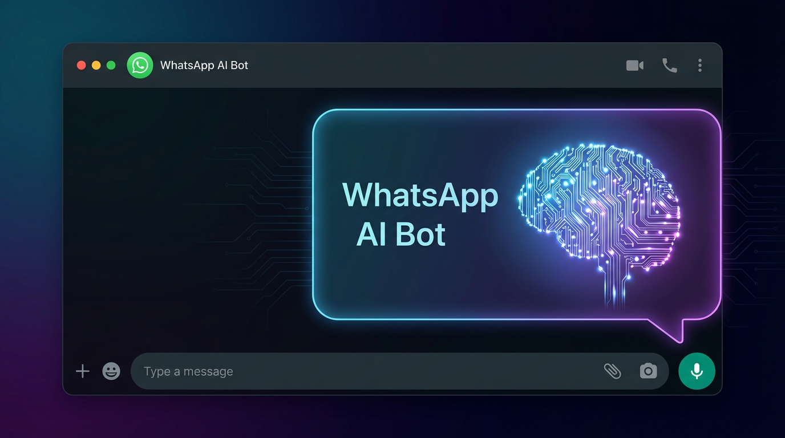
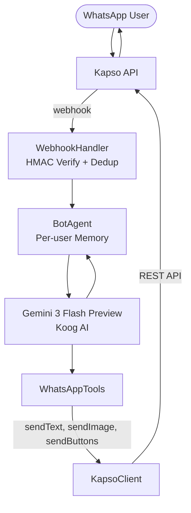

<div align="center">
  

  # WhatsApp AI Bot
  
  [](https://kotlinlang.org/)
  [](https://ktor.io/)
  [](https://aistudio.google.com/)
  [](LICENSE)

  **A production-ready WhatsApp bot powered by Google Gemini 3 Flash Preview and the Koog AI agent framework.**
  
  Built with Kotlin and Ktor, it handles real conversations, sends rich media, reacts to messages, and presents interactive button menus — all through the Kapso WhatsApp Cloud API.
</div>

---

## 🚀 Features

- **🧠 Intelligent Reasoning** — Powered by Gemini 3 Flash Preview for context-aware responses and tool execution.
- **📱 Rich Media Support** — Understands and sends text, images, videos, audio clips, documents, locations, reactions, and stickers.
- **💾 Per-User Memory** — Maintains conversation history independently for each user (up to 20 messages).
- **🛡️ Secure Webhooks** — HMAC-SHA256 signature verification and automatic message deduplication.
- **⚡ High Performance** — Built on Ktor and Coroutines with optimized thread management.
- **🌍 Multilingual** — Automatically responds in the same language the user writes in.

---

## 🛠️ What It Does

When a WhatsApp user sends a message to your number, the bot:

1.  **Receives** it via a secure webhook (HMAC-SHA256 verified).
2.  **Analyzes** it with a per-user AI agent that has full conversation memory.
3.  **Reasons** with Gemini 3 Flash Preview and selects the appropriate response action.
4.  **Responds** with a text reply, image, document, emoji reaction, or interactive button menu.

---

## 🏗️ Architecture



### Key Design Decisions

-   **One agent per message** — No shared mutable state across concurrent users.
-   **Shared HTTP executor** — Connection pool and TLS handshakes reused across invocations.
-   **Per-user chat memory** — Conversation history keyed on phone number (window: 20 messages).
-   **Webhook deduplication** — In-memory idempotency cache with 5-minute TTL.
-   **Isolated tool thread pool** — 2× CPU cores, separate from the shared IO dispatcher.

---

## 📋 Prerequisites

| Requirement | Version |
| :--- | :--- |
| **JDK** | 17 or later |
| **Gradle** | Included via `./gradlew` wrapper |
| **Kapso account** | [app.kapso.ai](https://app.kapso.ai) |
| **Google AI API key** | [aistudio.google.com](https://aistudio.google.com/app/apikey) |

---

## 🚀 Getting Started

### 1. Clone the repository

```bash
git clone <your-repo-url>
cd whatsapp-messenger
```

### 2. Configure environment variables

Copy the example file and fill in your credentials:

```bash
cp .env.example .env
```

Open `.env` and set each value:

```dotenv
# Google AI API key — powers the Gemini 3 Flash Preview model
# Get yours at https://aistudio.google.com/app/apikey
GOOGLE_API_KEY=AIza...

# Kapso API credentials
# Find these in Kapso dashboard → Settings → API Keys
KAPSO_API_KEY=kap_...

# Your Kapso phone number ID
# Found in Kapso dashboard → Phone Numbers
KAPSO_PHONE_NUMBER_ID=647015955153740

# Webhook secret for HMAC-SHA256 signature verification (strongly recommended)
# Set the same value in Kapso dashboard → Webhooks → Secret
KAPSO_WEBHOOK_SECRET=your_webhook_secret_here

# Server port (optional, defaults to 8080)
PORT=8080
```

> **Note on Kapso credentials:**
> 1. Sign up at [app.kapso.ai](https://app.kapso.ai)
> 2. Connect a WhatsApp phone number in the dashboard
> 3. Navigate to **Settings → API Keys** to get `KAPSO_API_KEY`
> 4. Navigate to **Phone Numbers** to get `KAPSO_PHONE_NUMBER_ID`
> 5. Navigate to **Webhooks** to set and copy `KAPSO_WEBHOOK_SECRET`

---

### 3. Build and Run

#### Development

**Option A — Gradle run**
```bash
./gradlew run
```

**Option B — With hot-reload**
```bash
./gradlew -t build & ./gradlew run
```

#### Production

**Option C — Fat JAR**
```bash
./gradlew build
java -jar build/libs/whatsapp-bot-1.0.0.jar
```

The server starts on `http://0.0.0.0:8080` by default. Verify it's running:

```bash
curl http://localhost:8080/
# → {"status":"ok"}
```

---

### 4. Expose and Register Webhook

Kapso needs to reach your server over the internet. Use a tunneling tool:

```bash
# Using ngrok
ngrok http 8080
```

1.  Open [app.kapso.ai](https://app.kapso.ai) → **Webhooks**
2.  Set the webhook URL to: `https://<your-public-url>/webhook`
3.  Paste your `KAPSO_WEBHOOK_SECRET` into the **Secret** field
4.  Save and verify — Kapso will send a test ping to confirm reachability.

---

## 📂 Project Structure

```text
whatsapp-messenger/
├── .env.example                             # Environment variable template
├── build.gradle.kts                         # Gradle build (Kotlin DSL)
└── src/main/
    ├── kotlin/com/whatsapp/bot/
    │   ├── Main.kt                          # Entry point, Ktor server setup, routes
    │   ├── agent/
    │   │   ├── BotAgent.kt                  # AI agent orchestrator + conversation memory
    │   │   └── WhatsAppTools.kt             # Tools exposed to the LLM (send/react/etc.)
    │   ├── config/
    │   │   └── Config.kt                    # Config loading and validation
    │   ├── kapso/
    │   │   ├── KapsoClient.kt               # HTTP client for Kapso REST API
    │   │   └── KapsoModels.kt               # Request/response + webhook DTOs
    │   └── webhook/
    │       └── WebhookHandler.kt            # Webhook parsing, sig verification, dedup
    └── resources/
        ├── application.yaml                 # Ktor + API key configuration
        └── logback.xml                      # Logging configuration
```

---

## 🤖 Bot Capabilities

The AI agent can invoke these actions autonomously:

| Action | Description |
| :--- | :--- |
| `sendTextReply` | Send a plain text message |
| `sendImage` | Send an image from a public URL with an optional caption |
| `sendDocument` | Send a file from a public URL with a display filename |
| `sendReaction` | React to the user's message with any emoji |
| `sendButtons` | Send a message with up to 3 quick-reply buttons |

---

## ⚙️ Configuration Reference

| Environment Variable | Required | Default | Description |
| :--- | :--- | :--- | :--- |
| `GOOGLE_API_KEY` | Yes | — | Google AI API key for Gemini |
| `KAPSO_API_KEY` | Yes | — | Kapso API bearer token |
| `KAPSO_PHONE_NUMBER_ID` | Yes | — | Your Kapso phone number ID |
| `KAPSO_WEBHOOK_SECRET` | No | — | HMAC-SHA256 webhook secret |
| `PORT` | No | `8080` | HTTP server port |

---

## 📝 License

This project is licensed under the MIT License - see the [LICENSE](LICENSE) file for details.

---

## 🤝 Contributing

Contributions are welcome! Please feel free to submit a Pull Request.

1.  Fork the Project
2.  Create your Feature Branch (`git checkout -b feature/AmazingFeature`)
3.  Commit your Changes (`git commit -m 'Add some AmazingFeature'`)
4.  Push to the Branch (`git push origin feature/AmazingFeature`)
5.  Open a Pull Request
